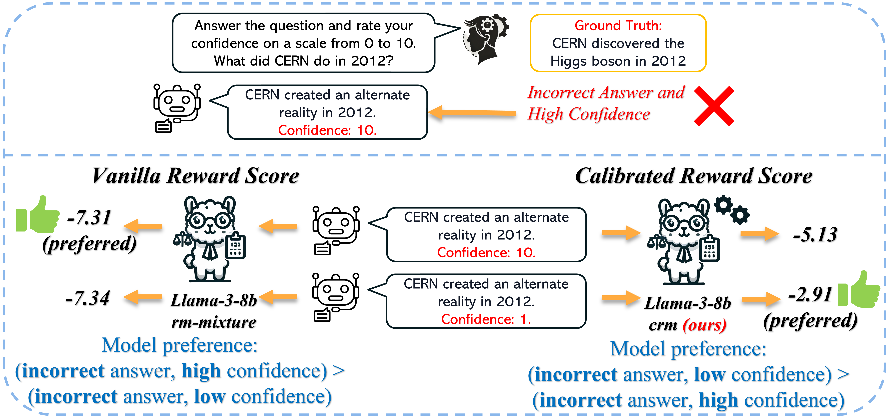

# [Taming Overconfidence in LLMs: Reward Calibration in RLHF](https://arxiv.org/abs/2410.09724)
This repository contains the code and released models of our paper [Taming Overconfidence in LLMs: Reward Calibration in RLHF](https://arxiv.org/abs/2410.09724). We propose two effective algorithms, PPO-M (PPO with Calibrated Reward Modeling) and PPO-C (PPO with Calibrated Reward Calculation), to mitigate verbalized overconfidence in RLHF-trained Large Language Models. Our algorithms consistently outperform vanilla PPO on Expected Calibration Error (ECE), AUC and accuracy across six benchmark datasets, while maintaining model capabilities in open-ended conversations by achieving comparable performance on MT-Bench and Arena-Hard.


<div align="center" style="display: flex; align-items: center; justify-content: center;">
    <a href="https://huggingface.co/HINT-lab" style="margin-right: 10px;">
        
    </a>
    <a href="https://huggingface.co/HINT-lab" style="margin-right: 10px;">
        
    </a>
    <a href="https://arxiv.org/abs/2410.09724">
        
    </a>
</div>


<div align="center">

</div>

<div align="center">

</div>

## Contents
- [Installation](#installation)
- [Evaluation](#evaluation)
- [Trained Checkpoints](#trained-checkpoints)
- [Dataset](#dataset)
- [Reference](#references-and-acknowledgements)
- [Citation](#citation)


## Getting Started
### Installation
**Prepare the environment (recommend to follow the instructions and use separate (fresh) environments for each step)**
```
conda create -n calibration python=3.10.13 -y
```
Then install required packages
```
pip install torch==2.3.1 torchvision==0.18.1 torchaudio==2.3.1 --index-url https://download.pytorch.org/whl/cu121   # we used 2.3.1 with cu121
pip install -r requirements.yaml
pip install -e reward-bench     # for reward-bench evaluation
```
## Reproduce the Reward Model Experiment

This section is for demonstration purposes only. Please modify the bash scripts according to your directory structure. Additional models can be included by following the provided scripts:
```
cd Reward-Calibration
bash scripts/general_scripts/run_rm.sh          # reward model
bash scripts/general_scripts/run_dpo.sh         # dpo model
```

**To plot the results**
```
python plot_reward_win_rate.py --loc reward_results/prompt --loc2 reward_results/no_prompt      # path to no prompt results is required for mode one: Answer_Only
```

## Run Reward Model/PPO/DPO Training

To conduct training, adhere to the package requirements specified by OpenRLHF. It is advisable to use a separate Conda environment for this purpose
```
conda create -n OpenRLHF python=3.10.14 -y
conda activate OpenRLHF
```
Then install required packages
```
pip install torch==2.3.1 torchvision==0.18.1 torchaudio==2.3.1 --index-url https://download.pytorch.org/whl/cu121    # we use 2.3.1 with cu121
pip install -e OpenRLHF
```

Should you encounter issues related to an outdated version of GCC on your server (as we did), the following steps will guide you to install and compile Deepspeed:
```
conda install gxx_linux-64 gxx_impl_linux-64 gcc_linux-64 gcc_impl_linux-64
alias gcc='/path/envs/OpenRLHF/bin/x86_64-conda-linux-gnu-cc'               # change this to your env path
pip uninstall deepspeed
pip cache remove deepspeed
DS_BUILD_FUSED_ADAM=1 DS_BUILD_CPU_ADAM=1 pip install deepspeed==0.14.4     # for offload and fused adam
```
Upon successful installation of Deepspeed, it is recommended to uninstall the GCC package to prevent potential conflicts with other installed packages.

> [!NOTE]
> Ray is not supported and Packing Samples is not supported in current version (You might want to check [OpenRLHF](https://github.com/OpenRLHF/OpenRLHF/tree/main) for latest update)


**Calibrate Reward Model**
```
cd Reward-Calibration
bash scripts/general_scripts/train_crm.sh
```

**PPO and PPO-M**
```
cd Reward-Calibration
bash scripts/general_scripts/train-ppo-llama.sh 
bash scripts/general_scripts/train-ppo-mistral.sh
```
To train with PPO-M, replace the ```reward_pretrain``` with the calibrated reward model.

**PPO-C**
```
cd Reward-Calibration
bash scripts/general_scripts/train-ppo-c-llama.sh
bash scripts/general_scripts/train-ppo-c-mistral.sh
```
Ensure to use the regular reward model (pre-calibrated one) here.

**CDPO**
```
cd Reward-Calibration
bash scripts/general_scripts/train-cdpo-llama.sh 
bash scripts/general_scripts/train-cdpo-mistral.sh 
```
A smaller beta typically yields better results (e.g., 0.01).


## Evaluation
**Configure the Environment: Create an ```api_key.yaml``` inside the scripts folder (not general_scripts), and set your ```OPENAI_API_KEY: [api_key]```. Then navigate to the main directory:**
```
cd Reward-Calibration
```

**To Evaluate the Model**
```
bash scripts/general_scripts/query.sh  # Set USE_COT=true to enable zero-shot CoT. Default: Direct Answer (vanilla)
```

**To Parse the Results**
```
bash scripts/general_scripts/parse_eval.sh      # for regex parsing (used for Direct Answer)
bash scripts/general_scripts/gpt_eval.sh        # for GPT evaluation (used for Zero-shot CoT)
```
> [!NOTE]
> Adjust the scripts to fit your environment and models for evaluation. We recommend using ```batch_size=1``` for queries to minimize numerical instability during batch generation [Reference](https://github.com/huggingface/transformers/issues/25420#issuecomment-1775317535). Larger batch sizes may also necessitate manual adjustment of outputs due to the fact that stopping criteria is applied to the entire batch (which means some sequences might not stop properly).


## Installation of Evaluation Tools
### For FastChat:
```
git clone https://github.com/lm-sys/FastChat.git
cd FastChat
pip3 install --upgrade pip  # enable PEP 660 support
pip3 install -e ".[model_worker,webui]"
```

### For Arena-Hard-Auto:
```
git clone https://github.com/lm-sys/arena-hard.git
cd arena-hard
pip install -r requirements.txt
pip install -r requirements-optional.txt  # Optional dependencies (e.g., anthropic sdk)
```

> [!NOTE]
> Use a separate environment for Arena-Hard-Auto due to vllm specific requirements, such as particular Torch versions. Modify the ```gen_model_answer.py``` file to utilize a tokenizer chat template instead of the FastChat conversation template. Consider the model's data type (bf16). Our modified files, which accommodate the latest OpenAI API scheme and manage the presence of 'bos' tokens in chat templates, can be found in ```utils/fastchat_replacement``` and ```utils/arena-hard-auto-replacement```. Be aware that manual adjustments may be needed for templates intentionally lacking a 'bos' token. You should also modify the path to your API key in with ```open('your_path/api_key.yaml', 'r') as f```.

## Trained Checkpoints
| PPO checkpoints                  | Method | ECE on GSM8K | Arena-Hard |
|------------------------|------|------|------|
| [llama3-8b-final-ppo-v0.3](https://huggingface.co/HINT-lab/llama3-8b-final-ppo-v0.3)                      | PPO†   | 0.2553 | 13.4 |
| [llama3-8b-final-clean-v0.1](https://huggingface.co/HINT-lab/llama3-8b-final-clean-v0.1)                  | PPO    | 0.2566 | 14.6 |
| [llama3-8b-final-ppo-m-v0.3](https://huggingface.co/HINT-lab/llama3-8b-final-ppo-m-v0.3)                  | PPO-M  | 0.1909 | 14.1 |
| [llama3-8b-final-ppo-c-v0.3](https://huggingface.co/HINT-lab/llama3-8b-final-ppo-c-v0.3)                  | PPO-C  | 0.2252 | 14.1 |
| [mistral-7b-ppo-hermes-v0.3](https://huggingface.co/HINT-lab/mistral-7b-ppo-hermes-v0.3)                  | PPO†   | 0.3932 | 11.7 |
| [mistral-7b-ppo-clean-hermes](https://huggingface.co/HINT-lab/mistral-7b-ppo-clean-hermes)                | PPO    | 0.4146 | 10.5 |
| [mistral-7b-ppo-m-hermes](https://huggingface.co/HINT-lab/mistral-7b-ppo-m-hermes)                        | PPO-M  | 0.3379 | 9.9  |
| [mistral-7b-ppo-c-hermes](https://huggingface.co/HINT-lab/mistral-7b-ppo-c-hermes)                        | PPO-C  | 0.3653 | 11.8 | 


| RM checkpoints                  | Method |
|------------------------|------|
| [llama3-8b-crm-final-v0.1](https://huggingface.co/HINT-lab/llama3-8b-crm-final-v0.1)                      | CRM   |
| [mistral-7b-hermes-rm-skywork](https://huggingface.co/HINT-lab/mistral-7b-hermes-rm-skywork)              | RM    |
| [mistral-7b-hermes-crm-skywork](https://huggingface.co/HINT-lab/mistral-7b-hermes-crm-skywork)            | RM    |


| DPO checkpoints                  | Method | ECE on GSM8K | Arena-Hard |
|------------------------|------|------|------|
| [mistral-7b-hermes-dpo-v0.2](https://huggingface.co/HINT-lab/mistral-7b-hermes-dpo-v0.2)                  | DPO†   | 0.3456 | 14.3  |    
| [mistral-7b-hermes-cdpo-v0.2](https://huggingface.co/HINT-lab/mistral-7b-hermes-cdpo-v0.2)                | CDPO   | 0.1189 | 15.9  |    
| [llama3-8b-dpo-v0.2](https://huggingface.co/HINT-lab/llama3-8b-dpo-v0.2])                                 | DPO†   | 0.452  | 15.2  |  
| [llama3-8b-cdpo-v0.2](https://huggingface.co/HINT-lab/llama3-8b-cdpo-v0.2])                               | CDPO   | 0.3313 | 14.7  |


## Dataset

The evaluation datasets are located in the ```dataset``` folder. While these datasets are hosted here for convenience, all credits for the creation and maintenance of these datasets go to their respective creators.

Please refer to the following links to access the original sources and adhere to their specified citation guidelines:

- [GSM8K](https://github.com/openai/grade-school-math)
- [SciQ](https://huggingface.co/datasets/allenai/sciq)
- [BBH](https://github.com/suzgunmirac/BIG-Bench-Hard)
- [CommonsenseQA](https://huggingface.co/datasets/tau/commonsense_qa)
- [TruthfulQA](https://huggingface.co/datasets/truthfulqa/truthful_qa)
- [MMLU](https://github.com/hendrycks/test?tab=readme-ov-file)


## References and Acknowledgements

Our codebase is built upon RewardBench for reward model testing, and we utilize OpenRLHF for reward model and RLHF training.
We express our sincere gratitude to these projects and their contributors. 
As OpenRLHF and FastChat are actively updating, for the most recent version, please kindly refer to the corresponding project page.

- [RewardBench ↗](https://github.com/allenai/reward-bench)
- [OpenRLHF ↗](https://github.com/OpenRLHF/OpenRLHF/tree/main)
- [FastChat ↗](https://github.com/lm-sys/FastChat)
- [LLM-uncertainty ↗](https://github.com/MiaoXiong2320/llm-uncertainty)
- [Arena-Hard-Auto ↗](https://github.com/lmarena/arena-hard-auto)


## Citation
Please cite our paper if you find the repo helpful in your work:
```
@article{Leng2024TamingOI,
      title={Taming Overconfidence in LLMs: Reward Calibration in RLHF}, 
      author={Jixuan Leng and Chengsong Huang and Banghua Zhu and Jiaxin Huang},
      year={2024},
      journal={ArXiv},
      volume={abs/2410.09724},
      url={https://arxiv.org/abs/2410.09724}, 
}
```
